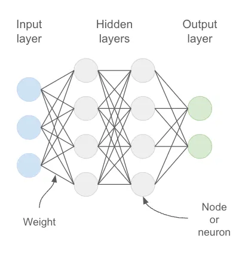

# LLM

- Large Language Models are very large deep learning models that are pre-trained on vast amount of data.
- The underlying transformer is a set of neural networks that consists of an encoder and a decoder with self attention capabilities.
- The encoder and decoder extract the meaning from a sequence of text and understand the relationships between words and phrases it.
- Transformer LLMs are capable of unsupervised training, although a more precise explaination is that transformers perform self learning. It is through this process that transformers learn to understand basic grammar, languages and knowledge
- Transformers processes entire sequence in parallel.
- Transformer neural network architecture allows the use of very large models, often with hundreds of billions of parameters.
- Such large-scale models can ingest massive amount of data, often from the internet, but also from sources such as the common crawl, which comprises more than 50 billion web pages, and wikipedia which has approximately 57 million pages.

---

### How do LLM work

- The key factor on how LLM work is the way it represent words.
- Earlier forms of machine learning used a numerical table to represent the words but it could not recognize the relationship between words. This limitation was overcome by using multi dimensional vectors called as word embeddings.
- Using word embeddings, transformers can pre process text as numerical representations through the encoder and understand the context of words and phrases with similar meanings as well as other relationship between words such as part of speech.
- It is then possible for LLMs to apply this knowledge of the language through the decoder to produce a unique output.

---

### Application of LLM

- Copywriting
- Knowledge base answering
- Text classification
- Code generation
- Text generation

---

### Three common learning models:

1. Zero shot learning:- Base LLMs can respond to a broad range of requests without explicit training, often through prompts, although answer accuracy varies.
2. Few shot learning:- By providing a few relevant training examples, base model performance significantly improves in that specific area.
3. Fine-Tuning:- This is an extension of few-shot learning in that data scientists train a base model to adjust its parameters with additional data relevant to the specific application.

---

## Key Concepts

- An LLM functions are like a black box that receives the text as input and generates a text output.
- Inside the box there is a type of neural network, a computing system representing layers of interconnected neurons to loosely mimic the human brain.

**Token**

- The input text is not processed as is by the LLM, but it is transformed into a series of tokens, which are basic units of text.
- A token can be a word, part of a word, or even a single character depending on the tokenization method used.
- For chat GPT, a rule of thumb is that one token is approximately 4 characters.

**Context Window/Context Length**

- The context window is the maximum range of text that the model takes into account as input.
- Generally, it is given in terms of the number of tokens.

**Transformers**

- The main strength of transformers lies in handling dependency and context between words to provide more qualitative results.

**Temperature**

- Temperature controls how creative or random the AI's answers are.

**Prompt**

- A prompt is simply what you tell the AI to do.

---

## Popular models

- GPT-4/GPT-4o (OpenAI)
- Claude (Anthropic)
- Gemini (Google)
